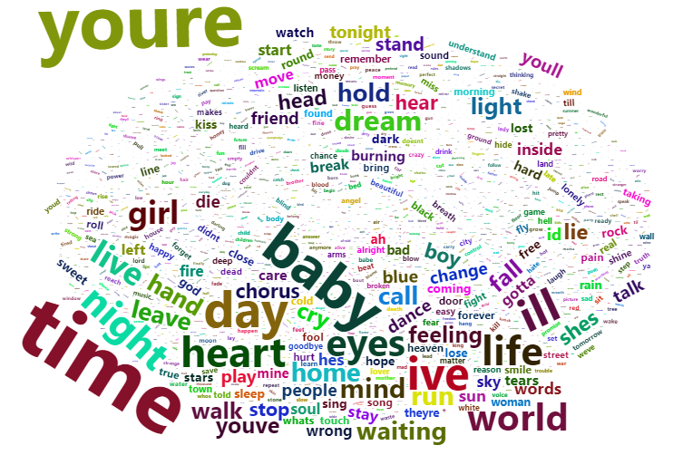
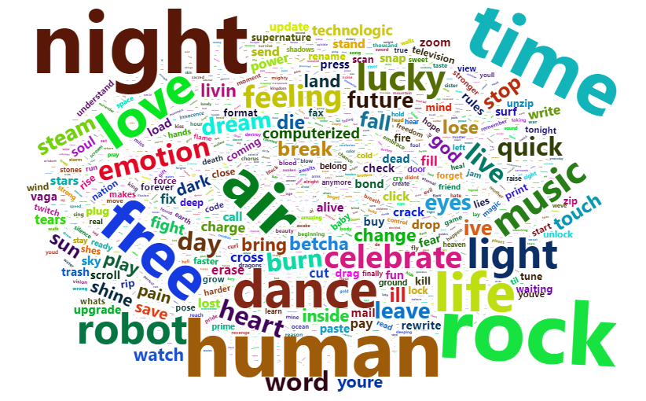
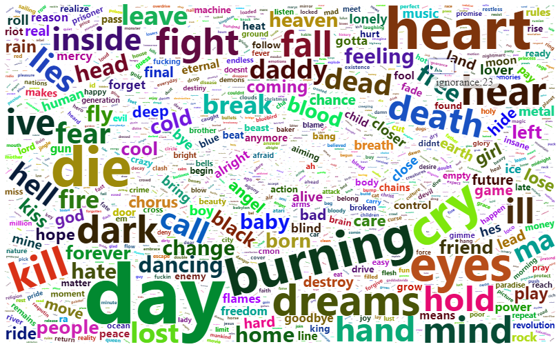
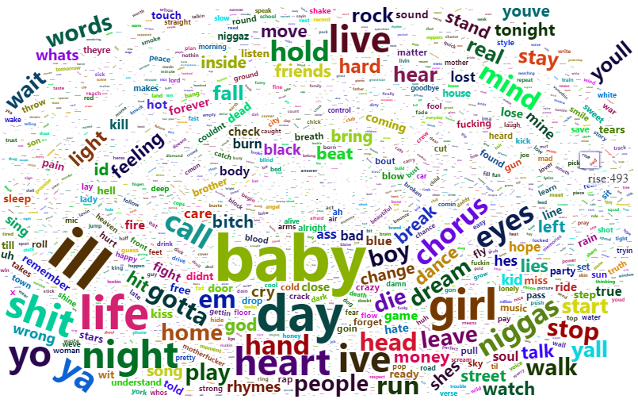
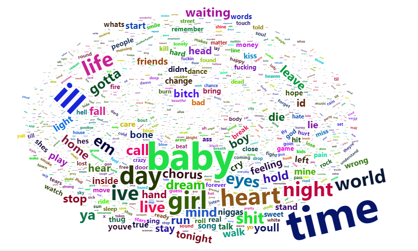
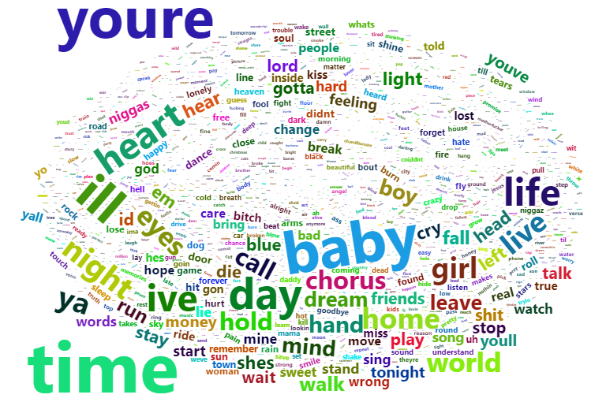
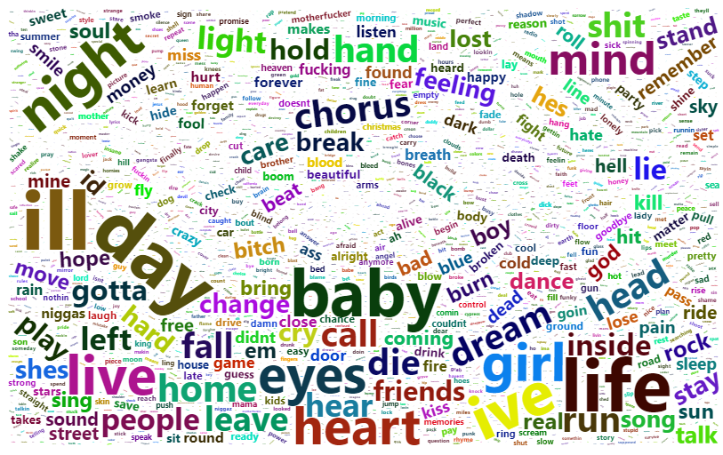
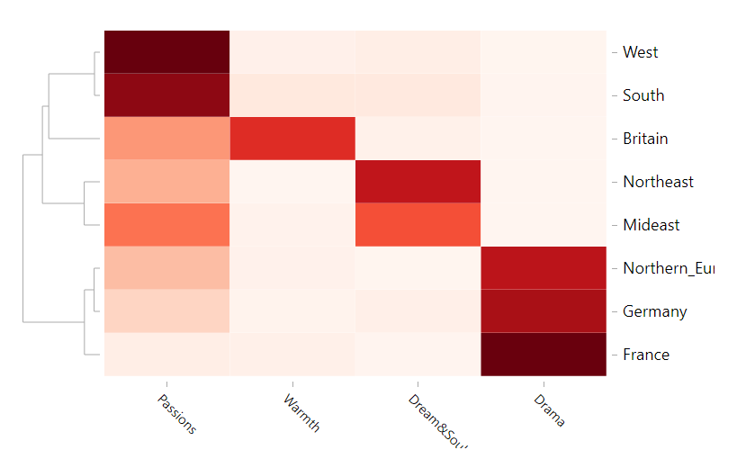

Music being quite subjective, do different cultures of regions affect the attitudes musicians hold, the topics they discuss and the sentiments they show in their lyrics?
This report will look into this: is there any statistical connection between region of musicians and their attitudes in lyrics.

## Step 0. Pre-processing and Loading Data
Consider two given data sets, dt_lyrics and artists.
Since I care about regions, I label all the musicians with their regions and seperate the data frame by region.

```{r load libraries, warning=FALSE, message=FALSE}
library(dbplyr)
library(tidyverse)
library(tm)
library(data.table)
library(tidytext)
library(DT)
library(rvest)
library(tibble)
#Sys.setenv(JAVA_HOME='C:/Program Files/Java/jre1.8.0_241')
library(qdap)
library(sentimentr)
library(gplots)
library(syuzhet)
library(factoextra)
library(beeswarm)
library(scales)
library(RColorBrewer)
library(RANN)
library(topicmodels)
library(wordcloud2)
library(knitr)
library(kableExtra)
library(d3heatmap)
```

(The code I use to process data can be found at "../lib/data_process.Rmd")

```{r}
#load data
load("../output/GBA_lyrics.RData")
load("../output/FRA_lyrics.RData")
load("../output/GEA_lyrics.RData")
load("../output/NEA_lyrics.RData")
load("../output/NEU_lyrics.RData")
load("../output/MEU_lyrics.RData")
load("../output/SOU_lyrics.RData")
load("../output/WEU_lyrics.RData")
```

## Step 1. Word Frequency Analysis
Firstly, plotting wordclouds could be helpful for us to seize the features of language musicians like to use in their lyrics.

```{r}
#plotting word cloud
plotwc <- function(lrc) {
  text.list<-NULL
  for (i in lrc$stemmedwords){
    New_file <- strsplit(i, split = " ")
    text.list <- c(text.list,New_file[[1]])
  }
  df_text <- data.frame(word = text.list)
  overall <- summarise(group_by(df_text, word), freq = n())
  wordcloud2(data = overall)
}

#plotwc(GBA_lyrics)
#plotwc(FRA_lyrics)
#plotwc(GEA_lyrics)
#plotwc(NEA_lyrics)
#plotwc(NEU_lyrics)
#plotwc(MEU_lyrics)
#plotwc(SOU_lyrics)
#plotwc(WEU_lyrics)




knitr::include_graphics("../figs/Northeuro.png")




```

By order, the ouputs are respectively: Britain, France, Germany, Northern Europe, Northeast USA, Mideast USA, South USA and West USA.

As we can see from the picture, there does exist a significant difference between European and American lyrics. European lyrics, especially Northern European and German lyrics, like to use words like: fall, death, break, burn, cry, leave; while American lyrics prefer to use words like: baby, girl, love, heart, sweet, life.
This would suggest that lyrics from european countries tend to use dark and depressed words, while American lyrics tend to sing about the bright things in relationship or life.
Additionally, we can notice that within European regions there is still a considerable difference. Comparing to dark German and Northern European lyrics, French lyrics often use more romantic words such as: night, rock, dance, air, free, music, future. This is in fact consistent with popular understanding of the difference between French and German, Northern European cultures.
In the case of U.S.A., the situation is quite similar. Western U.S. lyrics tend to use words like: baby, heart, eyes, night, hold, hand with a strong passion while musicians from Southeast would more often use: hold, stand, live, home, walk, street, words with a warm feeling of family life, comparing to their peers in west. 

It seems that different regional cultures do have a effect on how musicians write their lyrics, and this difference is seen consistent with common recognitions.

## Step 2. Topic Modeling
Then we get to look at the topics musicians from different regions like to talk about in their works.
We would seek to see the most popular four topics, which is set as: "Breakup", "Warmth", "Dream and Soul" and "Pain". (This is determined by the most frequant words of each cluster and set by me manually with a solid reason.)

```{r}
# trim data to make it runnable, the size of whole dataset is out of my laptop's capability
all_lyrics <- dplyr::bind_rows(dplyr::slice(GBA_lyrics, 1:1000), FRA_lyrics, GEA_lyrics, NEA_lyrics, dplyr::slice(NEU_lyrics, 1:1000), 
                               dplyr::slice(MEU_lyrics, 1:1000), dplyr::slice(SOU_lyrics, 1:1000), dplyr::slice(WEU_lyrics, 1:1000))
dtm1<-NULL
dtm2<-NULL
n <- 1
for (j in c("Britain", "France", "Germany", "Northern_Europe", "Northeast", "Mideast", "South", "West")) {
  if (nrow(dplyr::filter(all_lyrics, Origin == j)) > 1000) {
    for (i in dplyr::slice(dplyr::filter(all_lyrics, Origin == j), 1:1000)$stemmedwords){
      New <- strsplit(i, split = " ")
      dtm1 <- c(dtm1,New[[1]])
      dtm2 <- c(dtm2,rep(n, length(New[[1]])))
    }}
  else {
    for (i in dplyr::filter(all_lyrics, Origin == j)$stemmedwords){
      New <- strsplit(i, split = " ")
      dtm1 <- c(dtm1,New[[1]])
      dtm2 <- c(dtm2,rep(n, length(New[[1]])))
  }}
  n = n + 1
}
dtm3 <- summarise(group_by(data.frame(document = dtm2, term = dtm1), document, term), count = n())
dtm <- dtm3 %>% cast_dtm(document, term, count)
```

```{r}
#Number of topics
k <- 4
#Run LDA using Gibbs sampling
ldaOut <-LDA(dtm, k, method="Gibbs", control=list(alpha = 0.1))
ldaOut.topics <- as.matrix(topics(ldaOut))
#table(c(1:k, ldaOut.topics))
```

```{r}
# the most likely topics for each document
lda.topics <- as.matrix(topics(ldaOut))
# matrix containing the most likely terms for each topic
lda.terms <- as.matrix(terms(ldaOut, 30)) 
topic.prob <- as.data.frame(ldaOut@gamma)
topic.beta <- scale(ldaOut@beta)
top.terms <- NULL
for (i in 1:k){
  order <- order(topic.beta[i,], decreasing=T)[1:20]
  top.terms <- rbind(top.terms, ldaOut@terms[order])
}
#top.terms
#kable(lda.terms, align = 'c') %>% 
#                  kable_styling()  %>% 
#                  scroll_box(width = "100%", height = "500px")
```

```{r, warning = F}
topic.data <- all_lyrics

topictag <- c("Passions", "Warmth", "Dream&Soul", "Drama" )
colnames(topic.prob) <- topictag
topic.df <- cbind(dplyr::distinct(all_lyrics %>% transmute(Origin = as.factor(Origin)) %>% select(Origin)),
                  topic.prob)
topic.summary <- tbl_df(topic.df) %>%
                 group_by(Origin) %>%
                 summarise_each(funs(mean))
rownames(topic.summary) <- topic.summary$Origin
topic.heatmap <- topic.summary %>% select(-Origin)
#d3heatmap(topic.heatmap, colors='Reds', scale='none', Rowv=T, Colv=F, xaxis_font_size="15px")
```

```{r}

```
As we can see, there is a considerable difference between the topics mainly paid attention to by musicians from different regions.
Stories about love and passions seem more appealing to western and southern muscians, while Britain musicians love to write about warmth in the life. Northeast and mideast U.S. has a popularity of lyrics about dreams and souls, and lyrics of a dramatic topic are more main-stream in European mainland.

## Step 3. Sentiment Analysis
After topic modelling, we move to sentiment analysis. I am curious, given the wordclouds and topics being quite different, would there also be a huge gap between the sentiments shown in lyrics from different regions?

```{r}
#trim df to make code runnable
GBA_trim <- dplyr::slice(GBA_lyrics, 1:1000)
NEU_trim <- dplyr::slice(NEU_lyrics, 1:1000)
MEU_trim <- dplyr::slice(MEU_lyrics, 1:1000)
SOU_trim <- dplyr::slice(SOU_lyrics, 1:1000)
WEU_trim <- dplyr::slice(WEU_lyrics, 1:1000)

#sentiment analysis
senti <- function(lrc) {
  lrc$words <- word_count(lrc$lyrics)
  sentis <- NULL
  for(i in 1:nrow(lrc)){
    lyrics <- lrc$lyrics[i]
    if(lrc$words[i]>0){
      emotions <- get_nrc_sentiment(lyrics)
      emotions <- as.matrix(emotions)/lrc$words[i]
      sentis <- rbind(sentis, 
                          cbind(lrc[i,],
                                emotions))
    }
  }
  return(sentis)
}

GBA_sentis <- senti(GBA_trim)
FRA_sentis <- senti(FRA_lyrics)
GEA_sentis <- senti(GEA_lyrics)
NEA_sentis <- senti(NEA_lyrics)
NEU_sentis <- senti(NEU_trim)
MEU_sentis <- senti(MEU_trim)
SOU_sentis <- senti(SOU_trim)
WEU_sentis <- senti(WEU_trim)

```

```{r, fig.width=10, fig.height=8}
#plotting
emo.GBA=colMeans(select(GBA_sentis, anger:trust)>0.01)
col.use=c("red2", "darkgoldenrod1", 
            "chartreuse3", "blueviolet",
            "darkgoldenrod2", "dodgerblue3", 
            "darkgoldenrod1", "darkgoldenrod1")
barplot(emo.GBA[order(emo.GBA)], las=2, col=col.use[order(emo.GBA)], horiz=T, main="Britain Lyrics")

emo.FRA=colMeans(select(FRA_sentis, anger:trust)>0.01)
barplot(emo.FRA[order(emo.FRA)], las=2, col=col.use[order(emo.FRA)], horiz=T, main="France Lyrics")

emo.GEA=colMeans(select(GEA_sentis, anger:trust)>0.01)
barplot(emo.GEA[order(emo.GEA)], las=2, col=col.use[order(emo.GEA)], horiz=T, main="Germany Lyrics")

emo.NEA=colMeans(select(NEA_sentis, anger:trust)>0.01)
barplot(emo.NEA[order(emo.NEA)], las=2, col=col.use[order(emo.NEA)], horiz=T, main="Northern Europe Lyrics")

emo.NEU=colMeans(select(NEU_sentis, anger:trust)>0.01)
barplot(emo.NEU[order(emo.NEU)], las=2, col=col.use[order(emo.NEU)], horiz=T, main="Northeast Lyrics")

emo.MEU=colMeans(select(MEU_sentis, anger:trust)>0.01)
barplot(emo.MEU[order(emo.MEU)], las=2, col=col.use[order(emo.MEU)], horiz=T, main="Mideast Lyrics")

emo.SOU=colMeans(select(SOU_sentis, anger:trust)>0.01)
barplot(emo.SOU[order(emo.SOU)], las=2, col=col.use[order(emo.SOU)], horiz=T, main="South Lyrics")

emo.WEU=colMeans(select(WEU_sentis, anger:trust)>0.01)
barplot(emo.WEU[order(emo.WEU)], las=2, col=col.use[order(emo.WEU)], horiz=T, main="West Lyrics")
```

As we can see from the graphs, mojority of the regions have more songs of joy and other positive emotions than songs of sadness and fear (5 out of 8), while northern European , western American and German songs would more often be sad rather than joyful. This result is roughly consistent with the previous topic modelling and word frequency analysis where German and northern European songs tend to foucus more on dramatic topics and use words such as death, break, dark more oftern than songs of other regions. At the same time, it is quite consistent with our common senses about musics as well.

As it comes to other main-stream emotions such as "disgust", "surprise" and "anger", they have the lowest proportions in all the eight regions we discuss in this report. This could be due to their natures of being "not poetic" enough. A song about being "disgusted" may not seem very romantic.

Within five regions having mainly joyful lyrics, the emotions in lyrics seem to share almost identical distributions, except some minor switch of positions between joy, anticipation and trust or sadness and fear. Three regions that tend to like sad songs, on the other hand, have emotion distributions with considerable difference.

It turns out that when it comes to celebrate joy and happiness, even if the topics and languages differ, the emotions and feelings of songs could be similarly distributed for people all around the world. But when it comes to sad lyrics, the differences tend to be more noticable. This is in fact quite understandable. "All happy families are alike; each unhappy family is unhappy in its own way."

Assumingly, if we seperate the lyrics into different types of musics, then Rock would probably have a different distribution of emotions from Jazz and Folk. A following analysis on a specific type of music from different regions could probably birng us some more significant results, since the features which could affect the distribution of emotions "region" and "type" would be seperated in that case.

## Conclusion
In the eight regions this report analyzed, the usage of words can differ, and the topics that different regions would prefer are not quite the same, yet consistent with common senses. Regions that prefer happy songs tend to have all similar proportions of emotions, while musicians from sad song enthusiast regions may have different emotional proportions in their works. To conclude, regional culture difference sometimes does make musicians think differently.
